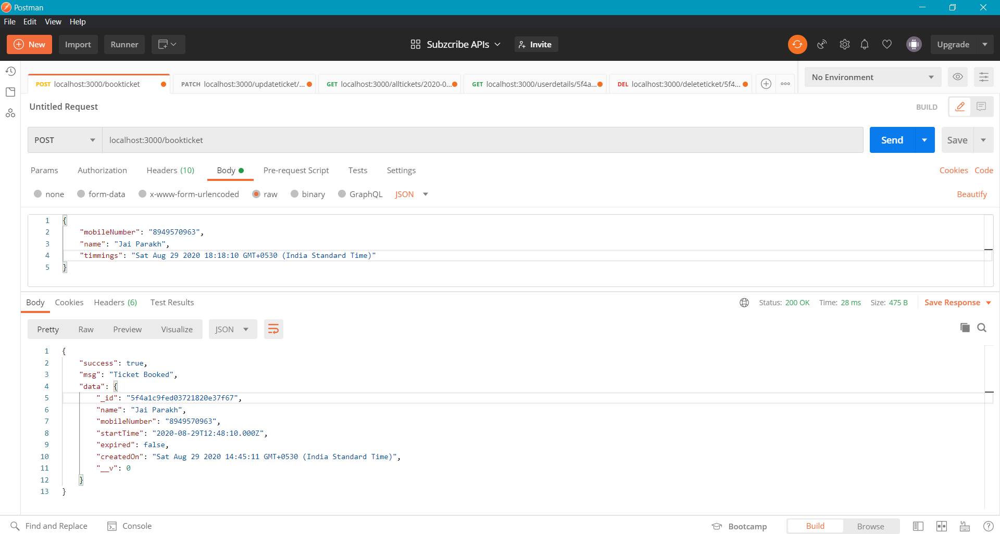
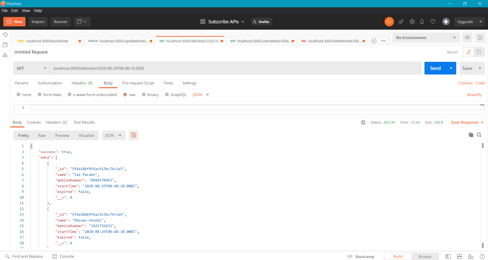

# Zomentum - Assignment

- The repo contains three files which contains all the tasks assigned for backend development.
    - index.js          (main file)
    - index.test.js     (test file)
    - models/Ticket.js  (Ticket Schema)
- Every route returns a json object that contains a 'success' boolean and either a msg or data.
- For setting the <b>expired flag</b> and <b>deleting the expired tickets automatically</b>, Agenda.js is used, which schedules a job that runs every 2 hours.
- In order to ensure that duplicate tickets are not issued for a particluar show, <b>Schema.index()</b> is used which ensures that every document is unique in the collection with respect to the specified attributes. For more info refer: <b>/models/Ticket.js</b>
- A check for ensuring that only 20 tickets are issued is also implemented in <b>models/Ticket.js</b>
- A middleware function ensures that passed id is a valid mongoDB Id. If not it throws an error.
- Three kinds of status codes are used in this API, 200, 400 and 404 to handle the response.
- The code passed all the 13 cases below. (Refer: <b>index.test.js</b>)

# Test Cases

  

# Routes

## /bookticket     (Type: POST)

- It takes the specified inputs in the body and returns the newly added document.
 

    
    <em>An endpoint to book a ticket using a user’s name, phone number, and timings</em>

 

    
    <em>It also ensures that, there's no duplicate tickets.</em>

 

## /updateticket     (Type: PATCH)

- It updates the ticket (by id) time and returns the updated ticket.
 

    
    <em>An endpoint to update a ticket timing.</em>

 

## /alltickets     (Type: GET)

- It takes desired time as a url parameter and returns a list of tickets.
 

    
    <em>An endpoint to view all the tickets for a particular time.</em>

    
    <em>If there's no tickets for a particular time it returns 404 and an error message.</em>

 

## /deleteticket     (Type: DELETE)

- It deletes the ticket the ticket with the specified id.
 

    
    <em>An endpoint to delete a particular ticket.</em>

 

## /userdetails     (Type: GET)

- It takes the id of the ticket and returns the user details.
 

    
    <em>An endpoint to view the user’s details based on the ticket id.</em>

 